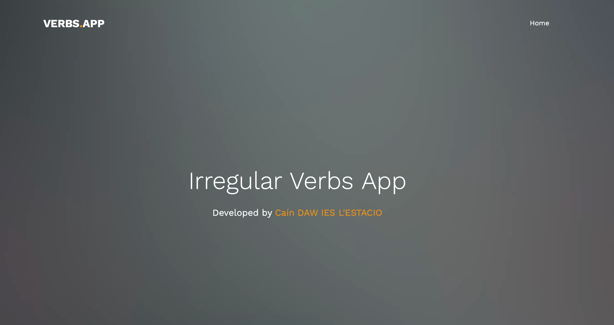
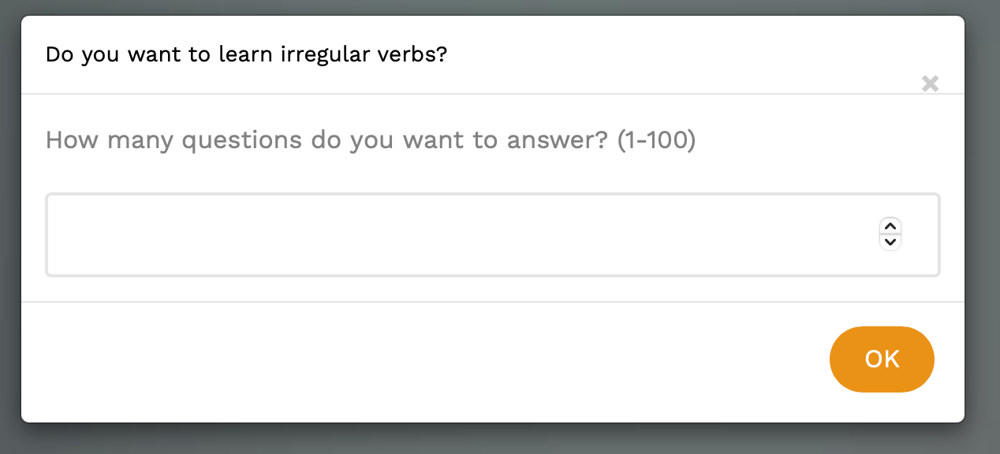
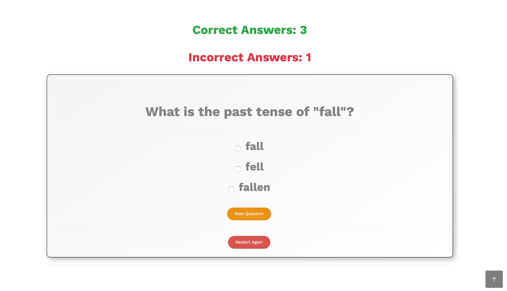

# Irregular Verbs Quiz Application

## Descripción
Esta aplicación web está diseñada para ayudar a los usuarios a aprender y practicar verbos irregulares en inglés de una manera interactiva y divertida. Los usuarios pueden responder preguntas relacionadas con el pasado y el participio de verbos irregulares mientras el sistema realiza un seguimiento de sus aciertos y errores.

---

## Características principales
1. **Generación de preguntas aleatorias**:
   - Las preguntas se generan dinámicamente basadas en una lista de verbos irregulares.
   - Tipos de preguntas:
     - Forma en pasado.
     - Participio pasado.

2. **Seguimiento del progreso**:
   - Contador de respuestas correctas y errores visibles en todo momento.
   - Los aciertos se muestran en verde (✔ Correct Answers).
   - Los errores se muestran en rojo (✘ Incorrect Answers).

3. **Interfaz atractiva**:
   - Diseño profesional con un enfoque moderno y limpio.
   - Botones estilizados, opciones de selección claras y organizadas.

4. **Modal de inicio**:
   - Permite al usuario especificar el número de preguntas (1-100) que desea responder antes de comenzar el cuestionario.

5. **Reinicio rápido**:
   - Botón para reiniciar el cuestionario en cualquier momento y comenzar desde cero.

---

## Cómo usar la aplicación
1. **Inicio**:
   - Al cargar la página, aparecerá un modal solicitando el número de preguntas.
   - Ingrese un número entre 1 y 100 y haga clic en "OK".

2. **Realizar el cuestionario**:
   - Lea la pregunta mostrada en la parte superior.
   - Seleccione una de las tres opciones disponibles.
   - Haga clic en "Next Question" para pasar a la siguiente pregunta.

3. **Seguimiento del progreso**:
   - A medida que responde preguntas, los contadores de aciertos y errores se actualizarán automáticamente.

4. **Reinicio**:
   - Puede hacer clic en "Restart Again" para reiniciar el cuestionario en cualquier momento.

---

## Requisitos
- Navegador web moderno compatible con HTML5, CSS3 y JavaScript.
- Conexión a internet (opcional si los recursos están disponibles localmente).

---

## Tecnologías utilizadas
- **Frontend**: HTML, CSS, Bootstrap.
- **JavaScript**: Generación de preguntas y control de lógica de la aplicación.
- **Interfaz de usuario**:
  - Diseño responsivo y moderno con Bootstrap y CSS personalizado.
  - Interactividad asegurada con JavaScript.

---

## Créditos
- **Desarrollado por**: Caín (2st DAW, IES L'ESTACIÓ).
- **Plantilla base**: FreeHTML5.co

---

## Mejoras futuras
- Ver un resumen de las preguntas falladas.
- Agregar un temporizador para cada pregunta.
- Implementar un sistema de puntuación basado en tiempo de respuesta.
- Guardar estadísticas de progreso a largo plazo para los usuarios.

¡Disfruta aprendiendo verbos irregulares con esta aplicación!

